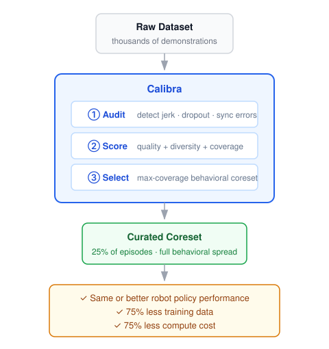
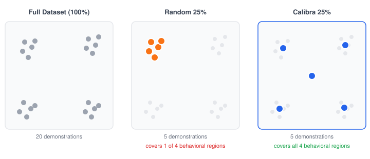
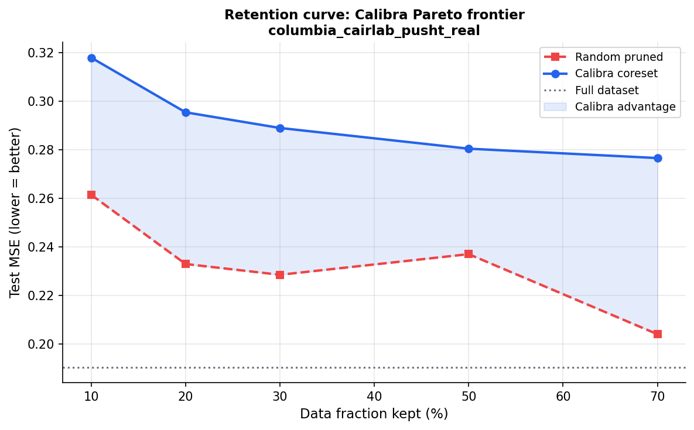
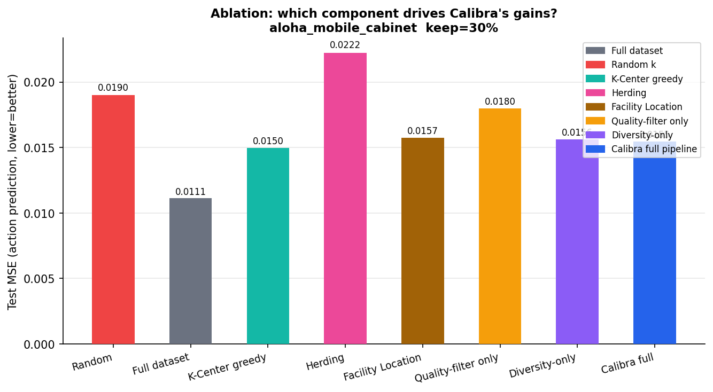
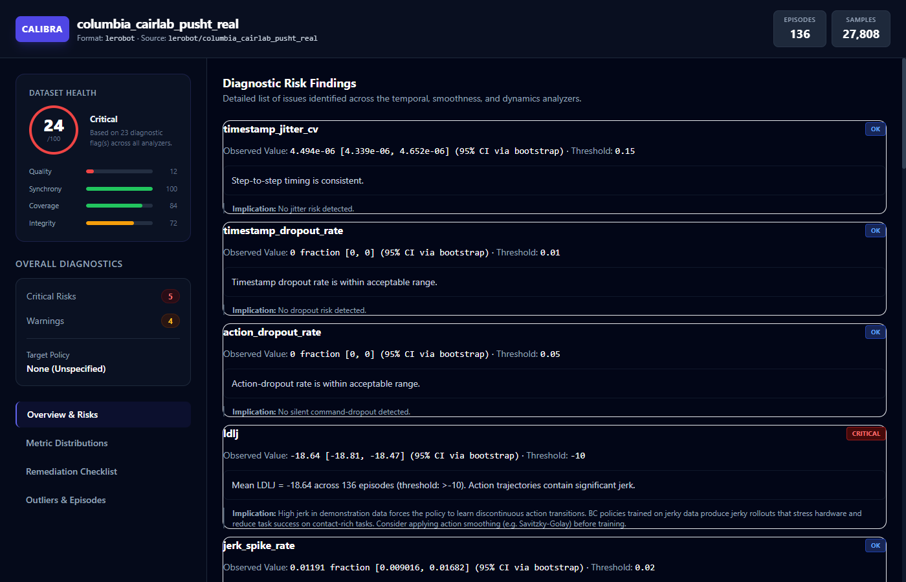
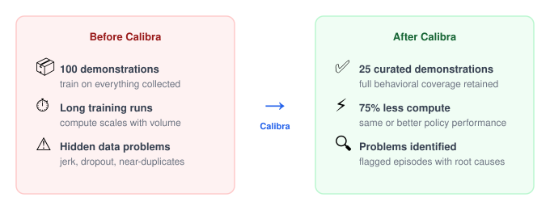

# Calibra

<p align="center">
  <a href="https://github.com/omertt27/Calibra/actions/workflows/ci.yml"></a>
  <a href="https://omertt27.github.io/Calibra/"></a>
  <a href="https://github.com/astral-sh/ruff"></a>
  <a href="LICENSE"></a>
</p>

<p align="center"><b>Audit robot datasets. Build better coresets. Train with less data.</b></p>

<p align="center">
Open-source tooling for robot dataset quality, diagnostics, and coreset selection.
</p>

---

## Highlights

- 🔍 Audit robot datasets for quality, synchrony, coverage, and task integrity
- ✂️ Reduce training data by up to 75% with quality-aware coreset selection
- 📊 Audit 30+ public LeRobot datasets with an interactive Hugging Face Space
- 🤖 Supports LeRobot, Isaac Lab, RLDS, HDF5, MCAP, and Hugging Face Hub
- 📦 Install with `pip install calibra-robotics`

---

## How it works

<p align="center">
  
</p>

---

## Quick start

```bash
pip install calibra-robotics

calibra audit lerobot/pusht
```

---

## Try it online

No installation required.

🔗 [Robot Dataset Health Check](https://huggingface.co/spaces/omert27/robot-dataset-health-check) (Hugging Face Space)

- Audit any LeRobot dataset
- View health score and percentile
- Compare against community benchmarks
- Download a full audit report

---

## Why quality-aware selection matters

Most robot learning labs collect thousands of demonstrations and train on all of them — silently ingesting bad data, wasting compute on near-duplicates, and producing undiagnosable policy failures.

| Problem | What Calibra does |
|---|---|
| Jerk spikes, dropped frames, sync errors | **Audit** — detect and flag bad episodes before training |
| 60–80% of episodes are near-duplicates | **Select** — maximize behavioral coverage in a smaller coreset |
| Policy failure cause is unknown | **Score** — decompose quality into measurable, falsifiable metrics |

---

## Why diversity-aware selection beats random

<p align="center">
  
</p>

Random selection picks a clustered subset. Calibra's coverage-based selector spreads selections across the behavioral space — ensuring the policy sees every behavioral mode, even rare ones.

---

## Benchmark results

<p align="center">
  
</p>

On real PushT data: at **10% retention**, Calibra achieves lower prediction error than training on the **full dataset**, while random selection degrades sharply. The shaded region is Calibra's advantage over random at every budget.

<p align="center">
  
</p>

Ablation across 5 seeds on ALOHA mobile (keep 30%): Calibra full pipeline and diversity-only both outperform all published baselines. Herding is the only method that reliably underperforms random.

**Mean improvement over random selection (5 seeds, 30% retention, 3 datasets):**

| Method | BC-MLP | ACT | Diffusion Policy |
|---|---:|---:|---:|
| Diversity-only | **+29.5%** | **+26.5%** | +11.9% |
| Calibra full | +24.5% | +23.7% | **+13.8%** |
| K-Center | +24.0% | +23.1% | +10.1% |
| Facility Location | +21.5% | +18.4% | +8.7% |
| Random | 0.0% | 0.0% | 0.0% |

Method rankings are stable across all three policy families (Spearman ρ ≥ 0.86). → [Full benchmarks and ablations](docs/benchmarks.md)

---

## Dashboard

<p align="center">
  
</p>

*Inspect dataset health, identify problematic demonstrations with root causes, and generate a training-ready coreset — all from one interface. Generated with `calibra audit lerobot/columbia_cairlab_pusht_real --html-out report.html`.*

---

## In practice

<p align="center">
  
</p>

---

## Commands

| Command | Description |
|---|---|
| `calibra audit` | Full diagnostic report with bootstrap CIs and per-episode outlier detection |
| `calibra prune` | Two-stage coreset: quality filter + greedy max-coverage selection |
| `calibra certify` | Structured CERTIFIED / PROVISIONAL / NOT CERTIFIED; `--json` for CI |
| `calibra predict` | Estimate training outcome before spending GPU time |
| `calibra watch` | Real-time quality feedback during teleoperation |
| `calibra score` | Composite 0–100 score across Quality, Synchrony, Coverage, Task Structure |
| `calibra compare` | Evidence-backed cross-dataset comparison with falsifiable claims |
| `calibra corrupt` | Inject synthetic corruptions to validate metric sensitivity |
| `calibra card` | Generate a HuggingFace dataset quality card |
| `calibra sim2real` | Quantify sim-to-real distribution gap and transfer risk |
| `calibra transfer` | Cross-embodiment compatibility scoring |
| `calibra cure` | Automatic data remediation (smoothing, resampling, trimming) |
| `calibra audit-all` | Bulk-audit an entire HF org; writes CalibraReport JSONs |
| `calibra site` | Generate a static leaderboard website from audit results |
| `calibra serve` | Local REST API server and web dashboard |

→ [Full command reference](docs/commands.md)

---

## LeRobot integration

```bash
# 1. Record demos
lerobot-record --robot-type so100 --repo-id $HF_USER/my_dataset

# 2. Curate and write the report
calibra prune /path/to/my_dataset --keep 0.3 --report results/my_dataset/latest.json

# 3. Train on the coreset
lerobot-train policy=act dataset_repo_id=./my_dataset_coreset
```

```python
from calibra.integrations.lerobot import load_dataset

ds = load_dataset("lerobot/pusht", report_path="results/pusht/latest.json")
# ds is a datasets.Dataset with only Calibra-approved episodes
```

---

## Isaac Lab → GR00T (NVIDIA)

```python
from calibra.integrations.isaac_lab import export_gr00t_manifest, filter_hdf5

export_gr00t_manifest("results/franka/latest.json", demos_path="demos.hdf5")
filter_hdf5("demos.hdf5", "results/franka/latest.json", "demos_coreset.hdf5")
```

```bash
calibra prune demos.hdf5 --keep 0.3 --policy gr00t --report results/franka/latest.json
python -m gr00t.train --manifest gr00t_manifest.json --demo-file demos_coreset.hdf5
```

---

## Python API

```python
from calibra.ingestion.registry import load
from calibra.pipeline import Pipeline
from calibra.pruning import CoresetSelector

batch = load("lerobot/pusht")
report = Pipeline().run(batch, policy_family="diffusion")

selector = CoresetSelector(keep_fraction=0.3)
result = selector.select(batch, report)
# result.keep_episode_ids → filter your dataset
```

---

## Install

> **PyPI package name:** `calibra-robotics` (the `calibra` name on PyPI is an unrelated package)

```bash
pip install calibra-robotics                      # core (numpy + pydantic only)
pip install 'calibra-robotics[lerobot]'           # LeRobot / HuggingFace Hub (recommended)
pip install 'calibra-robotics[hdf5]'              # HDF5 (Isaac Lab, Robomimic)
pip install 'calibra-robotics[rlds]'              # RLDS / TF Datasets
pip install 'calibra-robotics[mcap]'              # MCAP / ROS2 bags
pip install 'calibra-robotics[all]'               # everything
```

**Formats supported:** LeRobot v1/v2/v3 (Parquet), HuggingFace Hub IDs, HDF5 (Isaac Lab, Robomimic), RLDS/TF Datasets, MCAP/ROS2 bags.

---

## Paper

*Coming soon.* The central empirical finding — that the optimal coreset selection strategy depends on the data-retention budget — will be described in full detail.

---

## Citation

*Available after paper release.*

---

## Contributing

Calibra is not open to external pull requests or contributions at this time.

## Development

```bash
git clone https://github.com/omertt27/Calibra
pip install -e '.[all,dev]'
pytest              # 596 tests
ruff check .        # zero errors expected
```

---

## License

[Business Source License 1.1](LICENSE) — free for research and internal use, converts to Apache 2.0 on 2030-06-30. Commercial hosting requires a separate license. See [LICENSE](LICENSE) and [LICENSING.md](LICENSING.md). Contact: omertahtaci05@gmail.com
