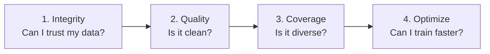

# Calibra

<p align="center">
  
</p>

**Dataset observability and coreset selection for robotics imitation learning.**

Calibra tells you what is wrong with your robot demonstrations — and removes the redundant ones — before you waste GPU time training on bad data.

```bash
pip install calibra-robotics
calibra integrity /data/my_demos.h5
calibra compare hf://lerobot/my_dataset aloha
calibra certify /data/my_demos --reference aloha --policy diffusion
calibra prune   /data/100k_episodes --keep 0.3 --out coreset.json
calibra retarget /data/isaac_lab.h5 --out retargeted/
```

---

## The workflow

Calibra is organized around the questions practitioners actually ask about a new dataset, in the order they ask them — not around a list of analyzers.



| Step | Question | Command | Docs |
|---|---|---|---|
| 1. Integrity | Can I trust this dataset? | `calibra integrity` | [Integrity Checks](integrity.md) |
| 2. Quality | Is it clean? | `calibra audit` / `calibra score` | [Command Reference](commands.md) |
| 3. Coverage | Is it diverse enough? | `calibra review` | [Command Reference](commands.md) |
| 4. Optimize | Can I train faster/cheaper? | `calibra prune` | [Command Reference](commands.md) |

Integrity checks are deliberately the first thing Calibra runs: timestamp sync, episode completeness, and camera freeze/duplicate-frame detection catch the failures practitioners hit most often, before anything about quality or diversity matters. See [Integrity Checks](integrity.md) for the full list.

---

## Why Calibra?

Robot learning labs collect thousands of demonstration episodes. Naively training on all of them:

- ❌ **Silently trains on bad data** — jerk spikes, dropped frames, communication lag, and stuck actuators all look like valid training signals to your policy.
- ❌ **Wastes compute on redundancy** — in a 10,000-episode dataset, 60–80% of episodes are near-duplicates. GPU cost scales with volume, not uniqueness.
- ❌ **Produces undiagnosable failures** — when a policy stalls or flails, you have no idea whether the cause is the architecture, the training recipe, or the data itself.

Calibra solves the data side by running deterministic mathematical estimators to flag anomalies and prune redundant data points before model training.

---

## Core Features

- **Six Powerful CLI Commands:**
    - `audit`: Diagnose dataset anomalies with bootstrap confidence intervals.
    - `compare`: Evidence-backed comparison against reference baselines.
    - `certify`: Structured pass/fail quality gates for CI/CD pipelines.
    - `prune`: Coreset selection filtering quality failures and maximizing behavioral diversity.
    - `corrupt`: Metric sensitivity verification by injecting synthetic noise.
    - `retarget`: Relative end-effector (EEF) action space conversion.
- **Multiple Formats Supported:** LeRobot v1/v2, HDF5 (Isaac Lab, Robomimic), TF Datasets/RLDS, MCAP/ROS2.
- **Evidence-Backed Assertions:** All analytical findings are linked to the Claims Registry which contains falsification criteria.
